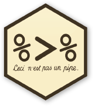

<style>
.forceBreak { -webkit-column-break-after: always; break-after: column; }

slides > slide.backdrop {
  background: white;
}

div.footnotes {
  position: absolute;
  bottom: 0;
  margin-bottom: 15px;
  width: 80%;
  font-size: 0.6em;
}

pre {
  font-size: 15px;
}

</style>


```{r setup, include=FALSE}
knitr::opts_chunk$set(echo = TRUE, warning = FALSE, eval = TRUE, message = FALSE, comment=NA)
options("kableExtra.html.bsTable" = T, digits = 2)
options(pillar.print_min = 5, pillar.print_max = 6)
library(tidyverse)
library(knitr)
library(kableExtra)
```


## Why should I care?

Why using R (or code in general) to handle data?

- Reduce human factor
- Reduce manual work
- Reproducibility
- Flexibility
- Speed
- > 70 to 80% of data analysis is data wrangling
- Open source
- Large community of friendly peer support

## Rules!

- Never change your data manually, document everything in code.
  - Making changes.
  - Reproducibility
- Organized working environment
  - .Rproj with folder per project with sub-directories for scripts, data, plots, etc
  - Short scripts: less code is always better.
- Comment your code (`# Ceci n'est pas un comment!`)
- If possible, use `tidyverse` instead of base R.


## Download repository

- [https://github.com/jensroes/hallam-r-workshop](https://github.com/jensroes/hallam-r-workshop)
- Open project by double clicking on `hallam-r-workshop.Rproj`
- `wrangling/exercises/`: exercises associated with each topic
- `wrangling/data/`: scripts read data from here
- `wrangling/slides.Rmd`: these slides in R markdown format


## Data wrangling: goals

- Data come in various formats (long, wide) and data type (xlsx, ods, json, csv, sav)
- Make data suitable to use: e.g. for statistical models, data viz, summary table
- Reveal information
- Summarise information
- Calculate variables


## `tidyverse` {.columns-2}

Collection of R packages for data science that share:

- common data philosophies
- grammar
- data structures
- best practice
- designed to work together


<p class="forceBreak"></p>

```{r fig.align='right', out.width="75%", echo = F}
knitr::include_graphics("../gfx/tidyverse-logo.png")
```

## `tidyverse` {.columns-2}

```{r eval = F}
# Installs 19 packages
install.packages("tidyverse")
```

```{r eval = F}
# Loads 6 packages
library(tidyverse)
```


<p class="forceBreak"></p>
```{r fig.align='right', out.width="75%", echo = F}
knitr::include_graphics("../gfx/tidyverse-logo.png")
```


## `tidyverse`


```{r fig.align='center', out.width="80%", echo = F}
knitr::include_graphics("../gfx/tidyverse-package-workflow.png")
```


## Tidy data 

```{r fig.align='center', out.width="90%", echo = F}
knitr::include_graphics("../gfx/tidy_1.png")
```

- Each variable must have its own column.
- Each observation must have its own row.
- Each value have its own cell.

## Why?

```{r fig.align='center', out.width="90%", echo = F}
knitr::include_graphics("../gfx/tidy_1.png")
```

- Consistent data structure allows easier learning of related tools because they have similar underpinning principles.
- Placing variables in columns takes advantage of R's vectorised nature.    


## `tidyverse`: verbs

- Must know: `read_csv`, `write_csv`, `glimpse`, `select`, `filter`, `mutate`, `group_by` / `ungroup`, `summarise`, `pivot_wider` / `_longer`, `_join`, `bind_rows` / `_cols`

- Also important: `count`, `pull`, `slice`, `across`, `recode`, `unique`, `n`, `where`, `everything`, `~` and `.`, `map`, `starts_with`, `ends_with`, `contains`, `separate`, `unite`, `transmute`

- There are a lot more but these are the most frequently used ones.


## Example data set: @blomkvist2017reference 

```{r fig.align='center', out.width="80%", echo = F}
knitr::include_graphics("../gfx/plos.png")
```

- Age-related changes in cognitive performance through adolescence and adulthood in a real-world task.

## Real-world task: StarCraft 2 {.columns-2}


```{r fig.align='left', out.width="80%", echo = F}
knitr::include_graphics("../gfx/sc2b.jpeg")
```

- Real-time strategy video game
- Nintendo Wii Balance Board

<p class="forceBreak"></p>

```{r fig.align='right', out.width="80%", echo = F}
knitr::include_graphics("../gfx/sc2.jpeg")
```

```{r fig.align='right', out.width="80%", echo = F}
knitr::include_graphics("../gfx/sc2c.jpeg")
```


## Example data set: @blomkvist2017reference {.columns-2}


```{r}
blomkvist <- read_csv("../data/blomkvist.csv")
glimpse(blomkvist)
```
<p class="forceBreak"></p>

- Average reaction time (`rt`) of dominant (`_d`) or non-dominant (`_nd`) `hand` or `foot` in msecs
- `medicine`: number of drugs used daily
- `pal`: physical activity level: 1 (least) to 4 (most active)


## tbls (tibble) {.columns-2}

- `tidyverse` is operating with tibbles
- Type of data structure
- Easier to read in console
- .csv: comma separated file

```{r eval = F}
# Imports data as data frame
data_as_frame <- read.csv("path_to_data/data.csv")
# Imports data as tibble
data_as_tibble <- read_csv("path_to_data/data.csv")
```

`readr` package: e.g. `read_csv`, `read_delim`, `read_tsv`


<p class="forceBreak"></p>

For other data formats:

- `haven` package: e.g. `read_dta`, `read_sav`, `read_sas`
- `readxl` package: e.g. `read_excel`, `read_xls`, `read_xlsx`


```{r eval = F}
# Summarise data structure in base R
str(data_as_frame)
# Summarise data structure in tidyverse
glimpse(data_as_tibble)
```

Continue with exercise 1


## `tidyverse` functions {.columns-2}

Functions follow the principle

```{r, eval = F}
function_name(data_name, argument)
```

where `argument` specifies what the function has to do with the data.

<p class="forceBreak"></p>

```{r, eval = F}
# Picking out variables
select(data, variable1) 
# Subsetting data
filter(data, variable > 100) 
# Change / add variables
mutate(data, variable_sqr = variable^2)
# Aggregate data
summarise(data, mean_var = mean(variable)) 
```


## Selecting variables 

```{r}
blomkvist
```


## Selecting variables   

Extracts only those variables you're interested in.

```{r}
select(blomkvist, id, sex, age)
```


## Selecting variables: select range 

```{r}
select(blomkvist, id:age)
```

## Selecting variables: index

```{r}
select(blomkvist, 1, 2, 3)
```

## Selecting variables: index range 

```{r}
select(blomkvist, 1:3)
```

## Selecting variables: rename

```{r}
select(blomkvist, id, sex, rt = rt_hand_d)
```


## Selecting multiple variables

```{r }
select(blomkvist, id, starts_with("rt_"))
```

## Selecting multiple variables 

```{r }
select(blomkvist, id, ends_with("d"))
```


## Selecting multiple variables

```{r }
select(blomkvist, id, contains("hand"))
```


## Selecting multiple variables 

```{r }
select(blomkvist, -contains("hand"))
```

## Selecting multiple variables 

```{r }
select(blomkvist, -ends_with("_d"))
```

## Selecting multiple variables 

```{r }
select(blomkvist, -sex:-smoker)
```

## Selecting multiple variables

```{r }
select(blomkvist, where(is.character))
```

## Selecting multiple variables

```{r }
select(blomkvist, where(is.numeric))
```

Continue with exercise 2


## Filtering data

Select variables of interest

```{r }
blomkvist_rt <- select(blomkvist, id, smoker, age, rt = rt_hand_d)
```


Subsetting data by selecting rows that meet one condition or more.

```{r eval = F}
filter(data, condition)
```


## Continuous variables {.columns-2}


```{r }
filter(blomkvist_rt, rt >= 708)
```
<p class="forceBreak"></p>

```{r }
filter(blomkvist_rt, rt > 708)
```

## Continuous variables


```{r }
filter(blomkvist_rt, rt > 708, rt < 900)
```

## Continuous variables {.columns-2}

```{r }
filter(blomkvist_rt, rt > 708 | rt < 900)
```
<p class="forceBreak"></p>

```{r }
filter(blomkvist_rt, rt < 708 | rt > 900)
```

## Categorical variables {.columns-2}

```{r }
unique(blomkvist_rt$smoker)
```

<p class="forceBreak"></p>

```{r }
filter(blomkvist_rt, smoker == "yes")
```

## Categorical variables

```{r }
filter(blomkvist_rt, smoker != "yes")
```


## Categorical variables {.columns-2}

```{r }
filter(blomkvist_rt, smoker %in% c("yes", "former"))
```

<p class="forceBreak"></p>

```{r }
filter(blomkvist_rt, !(smoker %in% c("yes", "former")))
```

## Missing data {.columns-2}

```{r }
filter(blomkvist_rt, is.na(smoker))
```
<p class="forceBreak"></p>

```{r }
filter(blomkvist_rt, !is.na(smoker))
```

Continue with exercise 3


## Mutating data {.columns-2}

Adding new variables to the data or changing existing ones.

```{r}
mutate(blomkvist_rt, rt_2 = rt * rt)
```

<p class="forceBreak"></p>

```{r}
mutate(blomkvist_rt, rt_2 = rt^2)
```

## Mutating data

```{r}
mutate(blomkvist_rt, log_rt = log(rt))
```


## Mutating data

```{r}
mutate(blomkvist_rt, is_slow = rt > 700)
```

## Mutating data {.columns-2}

```{r}
# oooops....
mutate(blomkvist_rt, mean_rt = mean(rt))
```

<p class="forceBreak"></p>


```{r}
# Data with missing values
y <- c(100, 1150, 200, 43, NA, 15)
```

```{r}
mean(y)
```
```{r}
mean(y, na.rm = TRUE)
```

```{r}
sd(y, na.rm = TRUE)
```


## Mutating data 


```{r}
mutate(blomkvist_rt, mean_rt = mean(rt, na.rm = TRUE))
```


## Mutating data {.columns-2}


```{r}
mutate(blomkvist_rt, mean_rt = mean(rt, na.rm = TRUE),
                     is_slow = rt > mean_rt)
```

<p class="forceBreak"></p>

```{r eval = F}
# or in one go
mutate(blomkvist_rt, 
       is_slow = rt > mean(rt, na.rm = TRUE))
```

## Mutating data: `recode()` 


```{r}
mutate(blomkvist_rt, smoker_recoded = recode(smoker, former = "former smoker",
                                                     yes = "smoker",
                                                     no = "non-smoker"))
```


## Mutating data: `cut()`

```{r}
mutate(blomkvist_rt, age_cat = cut(age, 
                                   breaks = 3, 
                                   labels = c("low", "middle", "high")))
```

## Mutating data: `case_when()`

```{r eval = F}
case_when(condition ~ do) # similar to ifelse()
```

```{r}
mutate(blomkvist_rt, smoker_age = case_when(smoker == "yes" & age > 60 ~ "senior smoker",
                                            is.na(smoker) | is.na(age) ~ "dunno",
                                            TRUE ~ smoker))
```

## Mutating data

Continue with exercise 4


## Grouping data with `group_by()`

Perform an action (function) for each level the grouping variable individually.

```{r}
# Group by levels of smoker
blomkvist_grouped <- group_by(blomkvist_rt, smoker)
blomkvist_grouped
```


## Mutate grouped data {.columns-2}

```{r}
mutate(blomkvist_rt, # not grouped
       mean_rt = mean(rt, na.rm = TRUE))
```


<p class="forceBreak"></p>


```{r}
mutate(blomkvist_grouped, # grouped data
       mean_rt = mean(rt, na.rm = TRUE))
```


## Never forget to *ungroup* your data! {.columns-2}

when you're done, otherwise you will keep performing operations on each level of the grouping variable.

```{r}
blomkvist_grouped # :(
```

<p class="forceBreak"></p>

```{r}
blomkvist_ungrouped <- ungroup(blomkvist_grouped)
blomkvist_ungrouped # :)
```


## Summarise data {.columns-2}

Summarising data using descriptive tools.

```{r}
summarise(blomkvist_rt, # not grouped
          mean_rt = mean(rt, na.rm = TRUE),
          sd_rt = sd(rt, na.rm = TRUE),
          min_rt = min(rt, na.rm = TRUE),
          max_rt = max(rt, na.rm = TRUE),
          N = n())
```
<p class="forceBreak"></p>

```{r}
summarise(blomkvist_grouped, # grouped data
          mean_rt = mean(rt, na.rm = TRUE),
          sd_rt = sd(rt, na.rm = TRUE),
          min_rt = min(rt, na.rm = TRUE),
          max_rt = max(rt, na.rm = TRUE),
          N = n())
```

## Grouping data

- Continue with exercise 5


## `across()` {.columns-2 .smaller}

Create a new column.

```{r}
mutate(blomkvist_rt, log_rt = log(rt))
```

<p class="forceBreak"></p>

Replace with transformed variable.

```{r}
mutate(blomkvist_rt, across(rt, log))
```

First argument of `across` will be used as first argument of function (`log`) which is supplied as second argument to `across`.


## Mutate data with `across()` 

```{r echo = F}
blomkvist <- select(blomkvist, -starts_with("pal_")) %>%
  drop_na()
```


```{r, eval = F}
# Instead of
mutate(blomkvist, rt_hand_d = log(rt_hand_d), 
                  rt_hand_nd = log(rt_hand_nd))
```


```{r}
# Do
mutate(blomkvist, across(c(rt_hand_d, rt_hand_nd), log))
```


## Mutate data with `across()` 

```{r}
mutate(blomkvist, across(starts_with("rt_"), log))
```

## Mutate data with `across()` 

```{r}
mutate(blomkvist, across(where(is.numeric), log))
```

## Mutate data with `c_across()`

```{r}
# Long way
mutate(blomkvist, mean_rt = (rt_hand_d + rt_hand_nd + rt_foot_d + rt_foot_nd)/4)
```

## Mutate data with `c_across()`

```{r eval=F}
# Long way
mutate(blomkvist, mean_rt = (rt_hand_d + rt_hand_nd + rt_foot_d + rt_foot_nd)/4)
```

```{r}
blomkvist_grouped <- rowwise(blomkvist) # each row is a group
mutate(blomkvist_grouped, mean_rt = mean(c_across(starts_with("rt_"))))
```

## Filter data with `across()`

```{r}
filter(blomkvist, rt_hand_d > 1000, rt_hand_nd > 1000, rt_foot_d > 1000, rt_foot_nd > 100)
```


## Filter data with `across()`

```{r}
filter(blomkvist, across(starts_with("rt_"), ~ . > 1000 ))
```

## What is "`~ .`"? {.columns-2}

```{r}
mutate(blomkvist_rt, across(rt, round, 0))
```

<p class="forceBreak"></p>

```{r}
mutate(blomkvist_rt, across(rt, ~round(., 0)))
```

## What is "`~ .`"? {.columns-2}

- "`~`": we want to make the position of the argument in function explicit.
- "`.`": the location of the argument.
- Always possible but necessary for logical operators (`>`, `==`) and when argument is not in first position of supplied function.


<p class="forceBreak"></p>

```{r}
mutate(blomkvist_rt, 
       across(rt, ~round(.,0)), # optional
       across(age, ~ . > 40),   # operator
       across(rt, ~paste("RT is ",.))) # position
```


## Summarise across variables

```{r}
summarise(blomkvist, rt_hand_d_mean = mean(rt_hand_d),
                     rt_hand_nd_mean = mean(rt_hand_nd))

```

## Summarise across variables

```{r}
summarise(blomkvist, across(c(rt_hand_d, rt_hand_nd), mean))
```

## Summarise across variables

```{r}
summarise(blomkvist, across(starts_with("rt_"), mean))
```


## Summarise across variables

```{r}
summarise(blomkvist, across(starts_with("rt_"), mean))
```

```{r}
summarise(blomkvist, across(starts_with("rt_"), list(mean = mean, sd = sd)))
```

## `across()`

- Continue with exercise 6


## Pivoting data

```{r }
blomkvist_wide <- select(blomkvist, id, starts_with("rt_"))
blomkvist_wide
```


## Tidy data 

```{r fig.align='center', out.width="90%", echo = F}
knitr::include_graphics("../gfx/tidy_1.png")
```


## Pivoting data to long format {.columns-2}

```{r}
blomkvist_wide
```


<p class="forceBreak"></p>

```{r eval = F}
pivot_longer(blomkvist_wide, cols = starts_with("rt_"))

```

```{r}
# or
pivot_longer(blomkvist_wide, cols = -id)
```


## Pivoting data to long format {.columns-2}

```{r }
pivot_longer(blomkvist_wide, cols = -id)
```


<p class="forceBreak"></p>

```{r}
pivot_longer(blomkvist_wide, cols = -id, 
             names_to = "variable", 
             values_to = "rt")
```


## Pivoting data to long format {.columns-2}


```{r}
pivot_longer(blomkvist_wide, cols = -id, 
             names_to = "variable",
             values_to = "rt")
```


<p class="forceBreak"></p>

```{r}
pivot_longer(blomkvist_wide, cols = -id, 
             names_to = c(".value", 
                          "response_by", 
                          "dominant"), 
             names_pattern = "(.+)_(.+)_(.+)")
```


## Pivoting data back to wide format 

```{r}
bk_long <- pivot_longer(blomkvist_wide, cols = -id, 
                        names_to = c(".value", "response_by", "dominant"), 
                        names_pattern = "(.+)_(.+)_(.+)")
bk_long
```

## Pivoting data back to wide format {.columns-2}

```{r}
bk_long
```


<p class="forceBreak"></p>


```{r}
pivot_wider(bk_long, 
            names_from = response_by, 
            values_from = rt)
```


## Pivoting data back to wide format {.columns-2}

```{r}
bk_long
```

<p class="forceBreak"></p>

```{r}
pivot_wider(bk_long, 
            names_from = c(response_by, dominant), 
            values_from = rt, 
            names_prefix = "rt_")
```


## Pivoting data

Continue with exercise 7


## Combine data

```{r, eval=F}
# Combine two datasets side-by-side
bind_cols(data_1, data_2)
# Stacking two data sets
bind_rows(data_1, data_2)
# Keep all rows of data_1 and add data_2
left_join(data_1, data_2)
# Keep all rows of data_2 and add data_1
right_join(data_1, data_2)
# Include all rows of both data sets
full_join(data_1, data_2)
# Include data that is present in both data sets
inner_join(data_1, data_2)
```


## Combine data: `bind_cols()` {.columns-2}

```{r}
bk_id_age <- select(blomkvist, id, age)
bk_id_age
```

<p class="forceBreak"></p>

```{r}
bk_med_smoke <- select(blomkvist, medicine, smoker)
bk_med_smoke
```


## Combine data: `bind_cols()`

```{r}
# Combine two datasets side-by-side
bind_cols(bk_id_age, bk_med_smoke)
```


## Combine data: `bind_rows()`

```{r}
bk_former_smokers <- filter(blomkvist, smoker == "former")
bk_smokers <- filter(blomkvist, smoker == "yes")
```

## Combine data: `bind_rows()`

```{r}
# Stacking two data sets
bk_smoking <- bind_rows(bk_former_smokers, bk_smokers)
```

## Combine data: `bind_rows()`


```{r}
slice_head(bk_smoking, n = 2)
```

```{r}
slice_tail(bk_smoking, n = 2)
```

- even works when columns are not in the same order as long as the names and types match


## Create two example data sets

```{r}
bk_smoker <- select(blomkvist, smoker, age)
bk_smoker_o40 <- filter(bk_smoker, age > 40)
```

```{r}
bk_sex <- select(blomkvist, sex, age)
bk_sex_u50 <- filter(bk_sex, age < 50)
```

## Create two example data sets {.columns-2}

```{r}
bk_smoker_o40
```

<p class="forceBreak"></p>

```{r}
bk_sex_u50
```


## Combine data: `left_join()` {.columns-2}


```{r}
# Keep all rows of bk_sex_u50
bk_joined <- left_join(bk_sex_u50, 
                       bk_smoker_o40, by = "age")
bk_joined
```

<p class="forceBreak"></p>

```{r}
range(bk_joined$age)
```


## Combine data: `right_join()` {.columns-2}

```{r}
# Keep all rows of bk_smoker_o40
bk_joined <- right_join(bk_sex_u50, 
                        bk_smoker_o40, by = "age")
bk_joined
```

<p class="forceBreak"></p>

```{r}
range(bk_joined$age)
```


## Combine data: `full_join()` {.columns-2}

```{r}
# Include all rows of both data sets
bk_joined <- full_join(bk_sex_u50, 
                       bk_smoker_o40, by = "age")
bk_joined
```

<p class="forceBreak"></p>

```{r}
range(bk_joined$age)
```

## Combine data: `inner_join()` {.columns-2}

```{r}
# Include only info that is present in both data sets
bk_joined <- inner_join(bk_sex_u50, 
                        bk_smoker_o40, by = "age")
bk_joined
```

<p class="forceBreak"></p>

```{r}
range(bk_joined$age)
```

## Combing data

Continue with exercise 8


## The pipe: `%>%` {.columns-2}

- `%>%` moves or "pipes" the result forward into the next function  
- `f(x)` is the same as `x %>% f()`  
- Short-cut: `Ctrl` + `Shift` + `M`

```{r eval = F}
select(data, myvar1, myvar2)
# or
data %>% select(myvar1, myvar2)
```

*assumes first argument is data


<p class="forceBreak"></p>

```{r fig.align='right', out.width="80%", echo = F}

```


## The pipe: `%>%` {.columns-2}


```{r eval = F}
# Instead of 
data_1 <- first_step(data)
data_2 <- second_step(data_2)
data_3 <- third_step(data_3)
data_4 <- fourth_step(data_4)

# or
first_step(
    second_step(
        third_step(
            fourth_step(data)
            )
          )
        )
```

<p class="forceBreak"></p>

```{r eval = F}
# Just do
data %>% 
  first_step() %>%
  second_step() %>%
  third_step() %>%
  fourth_step()
```


## The pipe: `%>%` {.columns-2}


```{r}
bk <- read_csv("../data/blomkvist.csv")
bk_rts <- select(bk, id, starts_with("rt_"))
bk_rts_flt <- filter(bk_rts, rt_hand_d > 1500)
bk_rts_flt
```

<p class="forceBreak"></p>

```{r}
read_csv("../data/blomkvist.csv") %>% 
  select(id, starts_with("rt_")) %>% 
  filter(rt_hand_d > 1500)
```


## The pipe: `%>%`

Continue with exercise 9


## Recommended reading {.columns-2}

- *R for Data Science* by Wickham and Grolemund
- This link [r4ds.had.co.nz/](https://r4ds.had.co.nz/)

<p class="forceBreak"></p>

```{r fig.align='right', out.width="65%", echo = F}
knitr::include_graphics("../gfx/wickham.jpg")
```


## References


